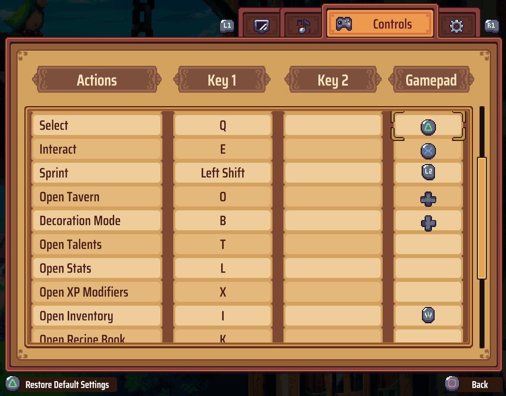

# Travellers Gamepad

Allows changing your gamepad button layout.

## Supported gamepad layouts:

### Xbox


### PlayStation


### Nintendo
*(reuses Xbox button icons, but properly remaps A, B, X, and Y buttons)*


## Where to Download

- [Nexus Mods](https://www.nexusmods.com/travellersrest)
- [Compiled releases](https://github.com/T3nak/Travellers-Rest-Travellers-Gamepad/releases)

## How to Install

1. Install [BepInEx](https://github.com/BepInEx/BepInEx/releases/tag/v5.4.23.2) (Stable version 5.4 for Windows 64; the filename will look like `BepInEx_win_x64_5.4.23.2.zip`).
1. Start the game, quit the game after it finishes loading.
1. This will create a BepInEx config file and a `plugins` folder that you can put additional mods in.
1. (optional) Enable the BepInEx Console (see the detailed guide or the BepInEx documentation for steps).
1. Copy the mod .dll to the `plugins` directory.

## How to Use

### TL;DR

Change the `Gamepad Layout` setting in the config file at `<Travellers Rest game directory>\BepInEx\config\net.pixelnaut.travellersrest.travellersgamepad.cfg` to one of the following:

- **Nintendo**
- **PlayStation**
- **Xbox**

### Changing Settings Manually

1. Install the mod and start the game.
1. BepInEx will create a file at `\BepInEx\config\net.pixelnaut.travellersrest.travellersgamepad.cfg` with default settings for the mod.
1. Exit the game, edit the config file, start the game.

### Using BepInEx Configuration Manager

1. Download the latest version of the BepInEx Confguration Manager for BepInEx 5 from their [releases](https://github.com/BepInEx/BepInEx.ConfigurationManager/releases) (the one that looks like `
BepInEx.ConfigurationManager.BepInEx5...`).
1. Extract the downloaded archive.
1. Copy the `ConfigurationManager` folder to your game's `BepInEx\plugins` folder.
1. Launch the game and press F1 to open the Configuration Manager.
1. Settings for this mod will be listed underneath `net.pixelnaut.travellersrest.travellersgamepad`.

### Settings Overview

#### General

- **Gamepad Layout**

  Forces the game to display gamepad button icons according to one of these options:

  - Auto - lets the game choose your button layout automatically
  - Custom - uses the bindings defined in the Custom Layout section
  - Nintendo - uses Nintendo-style buttons, as well as remaps the game's keybindings so that the A-button is used for selections and the B-button is used for cancellations appropriately.
  - PlayStation - uses PlayStation-style buttons
  - Xbox - uses Xbox-style buttons

#### Custom Layout

- **Button 1..10**

  Allows changing the icons of buttons individually. This can be useful for gamepads that do not conform to any button layout made available by the Gamepad Layout setting.

  E.g. the following setup will swap the triangle and cross icons on a traditional PlayStation gamepad:
  ```
  Button 1 = PlayStationCross
  Button 3 = PlayStationTriangle
  ```

  And this will swap the left and right trigger icons on a traditional Xbox gamepad:
  ```
  Button 7 = XboxRightTrigger
  Button 8 = XboxLeftTrigger
  ```

#### Mapping

- **Enable Custom Mappings**

  Enables/disables applying the custom mappings configured by the Button 1..4 setting.

- **Button 1..4**

  Allows swapping gamepad buttons. This is necessary for Nintendo gamepads that have the same button names as Xbox gamepads (A, B, X, Y) but appear at different physical spots on the gamepad.

  E.g. to map a Nintendo gamepad's buttons to their usual actions, one would configure these settings as:
  ```
  Button1 = Button4
  Button2 = Button3
  Button3 = Button2
  Button4 = Button1
  ```

  This results in button 1 invoking the game actions normally bound to button 4 (and vice versa), and button 2 invoking the game actions normally bound to button 3 (and vice versa).

#### Logging

- **Levels**

  Sets which log levels to show in the console output.

## FAQ

### Is this mod safe to add/remove mid play-through?

Yes.
 